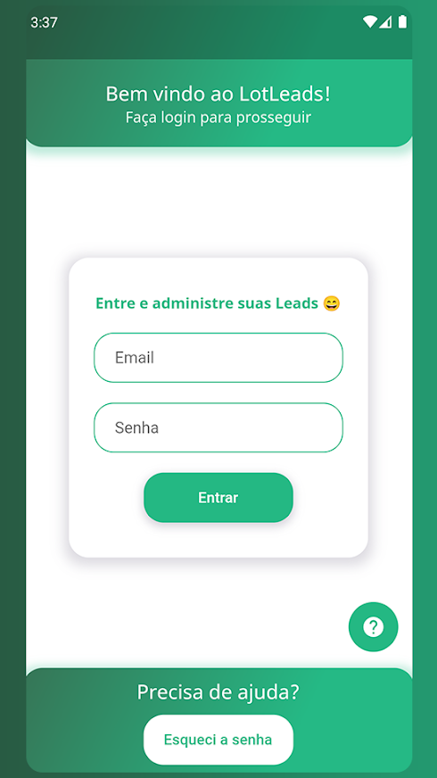
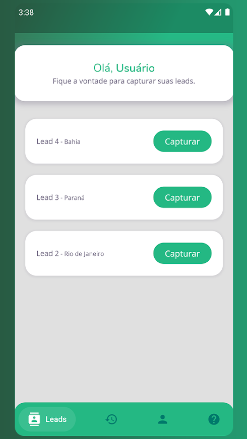

## LotLeads
#### O LotLeads foi um projeto feito no intuito de fixar o estudo e auxiliar a minha mãe que trabalhava como corretora de imóveis, basicamente ela fazia diversos anúncios utilizando o ADS do Facebook e precisava entrar em contato com todas as leads capturadas desse anúncio. Para facilitar o processo o LotLeads centralizava todas essas leads dentro do app e as classificava como pendente ou contato ja realizado, também com a funcionalidade de abrir uma conversa no whatsapp diretamente com a lead.

#### Tendo utilizado firebase para suprir o back e Flutter sem packages de gerenciamento de estado.

## Screenshots

#### Houve também a idéia de criar uma dashboard web para gerenciamento dos usuários, times e leads cadastradas. O mesmo foi iniciado porém não finalizado.
https://lotleads.app/

#### Utilizado exatamente as mesmas stacks do app mobile.

### Valeu pela visita 😁
